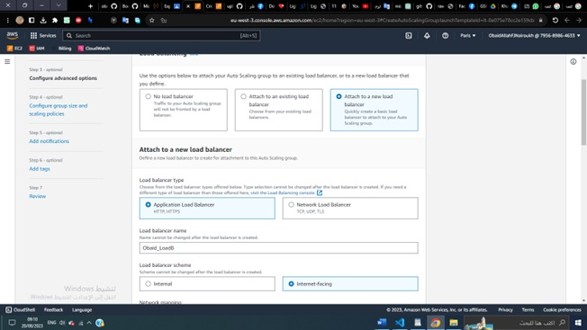

# Steps for deploying Express API to AWS

## First Creating Lunch template
 

 
### Lunch template is to make an instance we select or create new keypairs and security group

## Then we Create auto scale group
### And we Choosed launch template 
### also instance launch options And availability zoon

## We create new load balancer then we go back and associate  auto scale group with it

 

## Then the app deployed and worked from an instance ip :

 
### This is the health of target group:
 

## Then the app worked from load balancer dns name :
 

 
